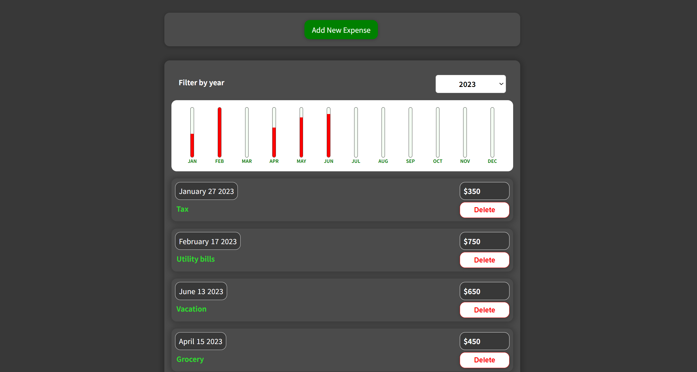
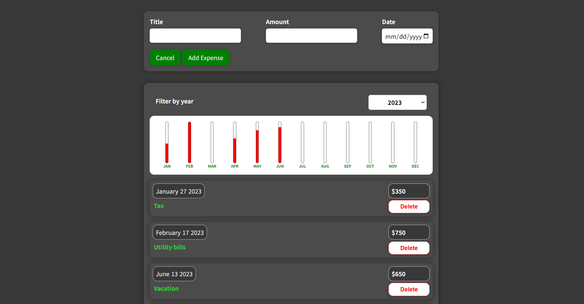

# Expense Tracker

## Description
This is a website where the user can save and track their monthly expenses, which will be displayed in the form of a chart. 

## Technologies Used
- HTML
- CSS
- JavaScript (ES6)
- React
- React-Redux (@reduxjs/toolkit)
- Firebase db

## Usage
Click 'Add New Expense' button and fill out the form to add a new expense and it will be displayed on the screen. Use 'Delete' button to delete the expense.

### Go to [Expense Tracker](https://armanbarseghyan83.github.io/expense-traker/)

Home page

Add new expense

## Questions
### Use the links below if you have any questions.
- Email Address - [armanbarseghyan83@gmail.com](mailto:armanbarseghyan83@gmail.com)
- Linkedin - [https://www.linkedin.com/in/arman-barseghyan](https://www.linkedin.com/in/arman-barseghyan)
- GitHub Profile - [https://github.com/ArmanBarseghyan83](https://github.com/ArmanBarseghyan83)
